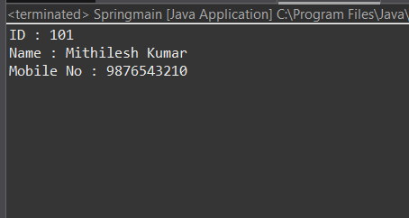

# Spring XML Configuration Project

## 📌 Project Overview
This project demonstrates **Spring Framework XML-based configuration**.  
It is a **core Spring (non-Maven) project** created using **Eclipse IDE**, focusing on understanding how Spring beans are configured, wired, and managed using XML.

This repository is useful for beginners who want to learn **Spring XML Configuration** before moving to Annotation-based or Java-based configuration.

---

## 🛠️ Technologies Used
- Java (Core Java)
- Spring Framework (XML Configuration)
- Eclipse IDE
- Git & GitHub

---

## 📂 Project Structure

spring-xml-based-configuration/
│
├── .settings/                  # Eclipse IDE settings
├── bin/                        # Compiled .class files
├── screenshots/                # Output screenshots
│   └── output.png
│
├── src/                        # Source code
│   ├── cs.bean/                # Bean classes
│   │   └── Stud.java
│   │
│   ├── cs.config/              # Spring XML configuration
│   │   └── app.xml
│   │
│   └── cs.main/                # Main class
│       └── Springmain.java
│
├── .classpath                  # Eclipse classpath file
├── .project                    # Eclipse project configuration
├── .gitignore.txt              # Git ignored files
├── README.md                   # Project documentation

---

## ⚙️ Spring XML Configuration
- Beans are configured using **XML**
- Dependency Injection is done using:
  - `<bean>`
  - `<property>`
- Application context is loaded using:

```java
ApplicationContext context =
        new ClassPathXmlApplicationContext("applicationContext.xml");
```

---

## ▶️ How to Run the Project

Clone the repository

```bash
git clone <your-github-repository-url>

```
2. Open Eclipse IDE                                                                                                                                                                                    
3. Import project: File → Import → Existing Projects into Workspace                                                                                                                                   
4. Add Spring JAR files to Build Path (if not added)                                                                                                                                                      
5. Run the main class as Java Application                                                                                                                                                                 

---

## 🖼️ Output Screenshot

<p align="center">
  
</p>

**Description:**  
The above screenshot shows the successful execution of the Spring XML Configuration project,
demonstrating dependency injection using XML-based bean configuration.

---

## 🎯 Learning Objectives

- Understand Spring IoC Container                                                                                                                                                                          
- Learn XML-based bean configuration                                                                                                                                                                     
- Practice Dependency Injection using XML                                                                                                                                                                     
- Build a strong foundation for Spring Annotations & Spring Boot                                                                                                                                                

---

## 🚀 Future Enhancements

- Add Annotation-based configuration                                                                                                                                                                         
- Add Java-based configuration                                                                                                                                                                                 
- Convert project to Maven                                                                                                                                                                                   
- Integrate JDBC                                                                                                                                                                                         
- Create a complete Spring Master Repository                                                                                                                                                                  

---

👤 Author

Mithilesh Kumar Mishra
Java & Spring Developer (Fresher)

---

⭐ Support

If you like this project, please ⭐ star the repository and share it.
